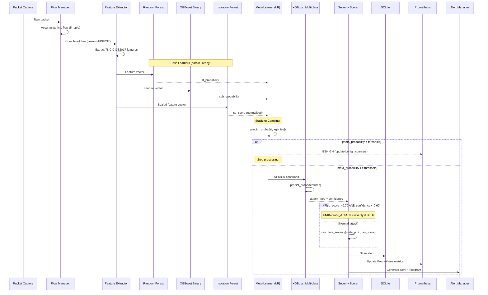

# Stacking Ensemble IDS Pipeline — Architecture Documentation

## Overview

The AI-Driven Real-Time Intrusion Detection System uses a **stacking ensemble architecture** with five machine learning models. Each model has a distinct role in the detection pipeline, and their outputs are combined by a meta-learner to produce a final binary decision.

This architecture is stronger than a simple two-stage pipeline because it:
- Leverages multiple model families (tree-based, boosting, anomaly detection)
- Uses a trained combiner (meta-learner) instead of a hardcoded threshold
- Can detect unknown/novel attacks through anomaly scoring
- Only runs the expensive multiclass classifier when an attack is confirmed

---

## Model Roles & Academic Terminology

| Model | Type | Academic Terminology | Technical Responsibility | Output |
|---|---|---|---|---|
| **Random Forest** | Supervised | Evidence Generation | Supervised probability estimation | `rf_probability` [0.0 – 1.0] |
| **XGBoost Binary** | Supervised | Evidence Generation | High-performance probability estimation | `xgb_probability` [0.0 – 1.0] |
| **Isolation Forest** | Unsupervised | Evidence Generation / Novelty Filter | Novelty / Anomaly score estimation | `iso_score` [0.0 – 1.0] |
| **Logistic Regression** | Meta-Learner | Decision Fusion Engine | Stacking combiner $\rightarrow$ Binary decision | `meta_probability` [0.0 – 1.0] |
| **XGBoost Multiclass** | Supervised | Attack Classification | Categorises 15 known attack classes | `attack_type` + `confidence` |

---

## Pipeline Architecture

```
Network Traffic
        │
        ▼
┌─────────────────────┐
│  Npcap Packet       │
│  Capture            │
└─────────┬───────────┘
          │
          ▼
┌─────────────────────┐
│  Flow Generation    │
│  (5-Tuple)          │
└─────────┬───────────┘
          │
          ▼
┌─────────────────────┐
│  Feature Extraction │
│  (78 CICIDS2017     │
│   Features)         │
└─────────┬───────────┘
          │
          ▼
┌─────────────────────┐
│  Preprocessing      │
│  (NaN imputation,   │
│   feature alignment)│
└─────────┬───────────┘
          │
          ▼
    ┌─────┴─────┐
    │           │
    ▼           ▼
┌────────┐ ┌────────┐ ┌──────────────┐
│ Random │ │XGBoost │ │  Isolation   │
│ Forest │ │ Binary │ │   Forest     │
└───┬────┘ └───┬────┘ └──────┬───────┘
    │          │              │
    ▼          ▼              ▼
  rf_prob   xgb_prob      iso_score
    │          │              │
    └──────────┴──────────────┘
               │
               ▼
    ┌──────────────────────┐
    │  Meta-Learner        │
    │  (Logistic           │
    │   Regression)        │
    │                      │
    │  Input: [rf_prob,    │
    │    xgb_prob,         │
    │    iso_score]        │
    └──────────┬───────────┘
               │
               ▼
        Binary Decision
               │
       ┌───────┴───────┐
       │               │
       ▼               ▼
   BENIGN           ATTACK
   (stop)              │
                       ▼
              ┌─────────────────┐
              │ XGBoost         │
              │ Multiclass      │
              │ (15 classes)    │
              └────────┬────────┘
                       │
                       ▼
              ┌─────────────────┐
              │ Unknown Attack  │
              │ Check           │
              │                 │
              │ IF iso > 0.70   │
              │ AND conf < 0.60 │
              │ → UNKNOWN_ATTACK│
              └────────┬────────┘
                       │
                       ▼
              ┌─────────────────┐
              │ Severity        │
              │ Scoring         │
              └────────┬────────┘
                       │
                       ▼
           ┌───────────┴───────────┐
           │                       │
           ▼                       ▼
    ┌──────────────┐      ┌──────────────┐
    │   SQLite     │      │  Prometheus  │
    │   Logging    │      │  Metrics     │
    └──────────────┘      └──────┬───────┘
                                 │
                                 ▼
                          ┌──────────────┐
                          │   Grafana    │
                          │  Dashboard   │
                          └──────────────┘
                                 │
                                 ▼
                          ┌──────────────┐
                          │    Alert     │
                          │  Generation  │
                          └──────────────┘
```

---

## Sequence Diagram



---

## Data Flow

### Step 1: Packet Capture → Flow Generation
- Npcap captures raw IP packets on the configured network interface.
- FlowManager aggregates packets into bidirectional flows using 5-tuple keys: `(src_ip, dst_ip, src_port, dst_port, protocol)`.
- A flow is exported when it reaches idle timeout (15s dev / 120s prod), absolute timeout (60s dev / 600s prod), or on TCP FIN/RST.

### Step 2: Feature Extraction
- 78 CICIDS2017-compatible features are computed from the completed flow.
- Features include: duration, packet counts, byte counts, flow rates, flag distributions, inter-arrival times, and statistical aggregates.

### Step 3: Preprocessing
- Feature vector is aligned to the 78-column order expected by all models.
- `NaN` and `Inf` values are replaced with training-set medians (`feature_medians.pkl`).
- A single NumPy array is created once and shared across all models (no duplicate preprocessing).

### Step 4: Base Learner Predictions (Single Pass)
All three base learners receive the same preprocessed feature vector:

1. **Random Forest** (`rf_binary.pkl`): `predict_proba()` → `rf_probability`
2. **XGBoost Binary** (`xgb_binary.pkl`): `predict_proba()` → `xgb_probability`
3. **Isolation Forest** (`isolation_forest.pkl`): `decision_function()` → negate → normalise to [0, 1] → `iso_score`

### Step 5: Meta-Learner Decision
The three base learner outputs form a 3-feature meta-vector:
```
meta_features = [rf_probability, xgb_probability, iso_score]
```

The Logistic Regression meta-learner (`meta_learner.pkl`) produces:
```
meta_probability = predict_proba(meta_features)[1]
is_attack = meta_probability >= meta_learner_threshold  (default: 0.50)
```

**Trained coefficients**: `[7.30, 7.39, 3.28]` with intercept `-9.94`
- RF and XGBoost have roughly equal weight (~7.3x)
- Isolation Forest contributes ~3.3x (anomaly detection signal)
- All three must agree for a high meta_probability

### Step 6: Binary Decision
- **BENIGN** (`meta_probability < threshold`): Stop processing, update benign statistics.
- **ATTACK** (`meta_probability >= threshold`): Proceed to multiclass classification.

### Step 7: Attack Categorisation
Only for confirmed attacks:
1. **XGBoost Multiclass** (`xgb_multiclass.pkl`): Predicts one of 15 CICIDS2017 attack classes.
2. **Unknown Attack Check**: If `iso_score > 0.70` AND `multiclass_confidence < 0.60`, classify as `UNKNOWN_ATTACK` with severity `HIGH`.

### Step 8: Severity & Alerting
- Severity is computed from: `meta_probability * 0.65 + iso_score * 0.35`
- Results are sent to: SQLite, Prometheus, Grafana, Alert Manager, and optionally Telegram.

---

## Configuration

All thresholds are configurable in `config.json`:

| Key | Default | Description |
|-----|---------|-------------|
| `binary_threshold` | 0.50 | Legacy XGBoost threshold (not used in stacking) |
| `meta_learner_threshold` | 0.50 | Meta-learner decision boundary |
| `unknown_attack_iso_threshold` | 0.70 | ISO anomaly score for unknown attack detection |
| `unknown_attack_confidence_threshold` | 0.60 | Multiclass confidence for unknown attack detection |

---

## Model Files

| File | Directory | Size | Description |
|------|-----------|------|-------------|
| `rf_binary.pkl` | `models/binary/` | ~76 MB | Random Forest (300 trees, max_depth=20) |
| `xgb_binary.pkl` | `models/binary/` | ~1.5 MB | XGBoost binary (300 trees, max_depth=8) |
| `isolation_forest.pkl` | `models/anomaly/` | ~1.4 MB | Isolation Forest (200 trees, BENIGN-fitted) |
| `meta_learner.pkl` | `models/stacking/` | <1 KB | Logistic Regression meta-learner |
| `xgb_multiclass.pkl` | `models/multiclass/` | ~8.7 MB | XGBoost 15-class classifier |
| `label_encoder.pkl` | `models/multiclass/` | <1 KB | Label encoder (int → class name) |
| `scaler.pkl` | `models/preprocessing/` | ~4 KB | StandardScaler for ISO Forest input |
| `feature_medians.pkl` | `models/preprocessing/` | ~2 KB | Feature medians for NaN imputation |
| `multiclass_feature_columns.pkl` | `models/preprocessing/` | ~1.5 KB | 78-feature column order |

---

## Prometheus Metrics

### New Metrics (Stacking Ensemble)
| Metric | Type | Description |
|--------|------|-------------|
| `ids_rf_probability` | Gauge | Latest RF attack probability |
| `ids_meta_probability` | Gauge | Latest meta-learner attack probability |
| `ids_rf_model_loaded` | Gauge | RF model load status (1=loaded) |
| `ids_meta_learner_loaded` | Gauge | Meta-learner load status (1=loaded) |
| `ids_unknown_attacks_total` | Counter | Total UNKNOWN_ATTACK classifications |

### Existing Metrics (Preserved)
| Metric | Type | Description |
|--------|------|-------------|
| `ids_xgb_probability` | Gauge | Latest XGBoost binary probability |
| `ids_iso_score` | Gauge | Latest ISO anomaly score |
| `ids_model_confidence` | Gauge | Latest multiclass confidence |
| `ids_predictions_total` | Counter | Total predictions made |
| `ids_attacks_detected_total` | Counter | Total attack classifications |
| `ids_benign_detected_total` | Counter | Total benign classifications |
